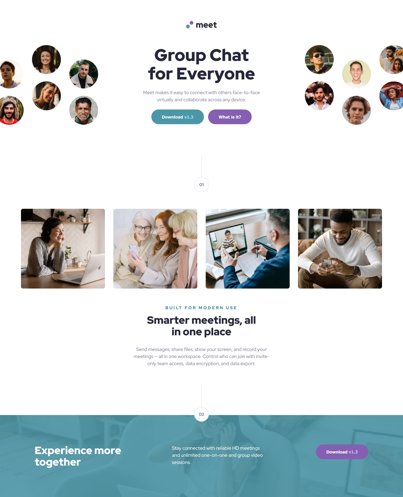

# Frontend Mentor - Meet Landing Page 

## Table of contents

- [Overview](#overview)
  - [The challenge](#the-challenge)
  - [Screenshot](#screenshot)
  - [Live preview](#live-preview)
  - [Solution retrospective](#solution-retrospective)

## Overview

### The challenge

The challenge was to build out a meet landing page and get it looking as close to the design as possible.

### Screenshot

### Live preview

- Live Site URL: [Live preview](https://marioncts.github.io/Meet-Landing-Page/)

### Solution retrospective

In this solution, I used Sass for the first time to work with a CSS preprocessor. I initially struggled to write SCSS code due to my long-established habits with pure CSS. However, I quickly discovered that being able to define multiple variables was a game-changer, and I really enjoyed coding this way. I also practiced writing DRY (Don't Repeat Yourself) code and naming elements according to the BEM methodology (blocks, elements, modifiers).

Including the time I spent learning Sass, it took me two days to complete this solution. I wanted to further experiment with the clamp property to keep the page responsive, although I sometimes found it unnecessarily complicated. Could someone offer advice on how to maintain code that is both responsive and simple?

Any feedback would be greatly appreciated!